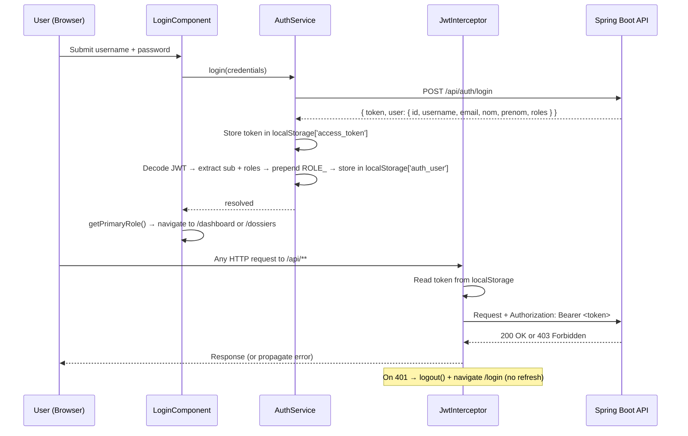
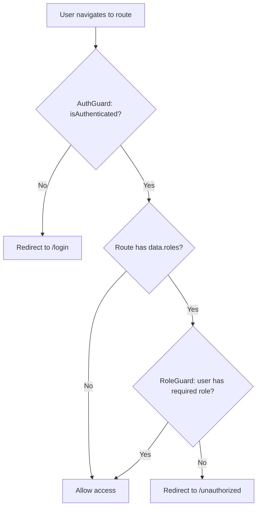

# Design Document — Role-Based Authentication & Access Control (RBAC)

## Overview

This document describes the technical design for implementing a fully functional RBAC system in the GAC application. The work spans two codebases:

- **Backend** (`GAC-FE`, Spring Boot 3.3.5 / Java 21): minimal field additions and logic corrections only — no refactoring, no schema changes.
- **Frontend** (`gac-frontend`, Angular 21 standalone components + Angular Material): fix broken contracts, implement consistent role enforcement, add missing routes and components.

The core problem is a set of broken contracts between the two sides: the frontend reads `response.accessToken` but the backend returns `response.token`; the interceptor tries a `/auth/refresh-token` endpoint that does not exist; post-login redirects point to routes that do not exist; role strings are inconsistent across guards, sidebar, and JWT. This design corrects all of these in the minimal way required by the requirements.

---

## Architecture

The system follows a stateless JWT architecture. No server-side session is maintained.





---

## Components and Interfaces

### Backend Components (minimal changes only)

#### `UserRequestDTO` — add fields
```java
// Add to existing class (no removals):
private String nom;       // optional
private String prenom;    // optional
private List<Long> roleIds; // optional — if provided, overrides default RESPONSABLE
```

#### `UserResponseDTO` — add fields
```java
// Add to existing class (no removals):
private String nom;
private String prenom;
private List<String> roles; // role name strings, e.g. ["ADMIN", "RESPONSABLE"]
```

#### `UserMapper` — update mappings
- `toResponseDto(User)`: add mappings for `nom`, `prenom`, and `roles` (map `Set<Role>` → `List<String>` of role names).
- `toEntity(UserRequestDTO)`: remove `@Mapping(target = "nom", ignore = true)` and `@Mapping(target = "prenom", ignore = true)` so MapStruct maps them automatically from the DTO.

#### `UserServiceImpl.create()` — fix role assignment
```java
// Replace hardcoded RESPONSABLE logic with:
if (request.getRoleIds() != null && !request.getRoleIds().isEmpty()) {
    Set<Role> roles = new HashSet<>(roleRepository.findAllById(request.getRoleIds()));
    if (roles.isEmpty()) throw new ResourceNotFoundException("No valid roles found");
    user.setRoles(roles);
} else {
    Role defaultRole = roleRepository.findByName("RESPONSABLE")
        .orElseThrow(() -> new ResourceNotFoundException("Default role not found"));
    user.setRoles(Set.of(defaultRole));
}
```

#### `UserServiceImpl.update()` — add nom/prenom support
```java
// Add to existing update() method:
if (request.getNom() != null) user.setNom(request.getNom());
if (request.getPrenom() != null) user.setPrenom(request.getPrenom());
```

No changes to `SecurityConfig`, `JwtUtil`, `AuthController`, or any other backend class.

---

### Frontend Components

#### `AuthResponse` model (`core/models/user.model.ts`)
```typescript
// Replace broken interface:
export interface AuthResponse {
  token: string;           // was: accessToken — must match backend field name
  user: {
    id: number;
    username: string;
    email: string;
    nom?: string;
    prenom?: string;
    roles?: string[];      // role names from backend (without ROLE_ prefix)
  };
}
```

#### `AuthService` (`core/services/auth.service.ts`)

Key changes:
- Read `response.token` (not `response.accessToken`).
- Remove all `refreshToken()` logic and the `REFRESH_TOKEN_KEY` constant.
- Remove the call to `/auth/logout` in `logout()`.
- In `updateUserFromToken()`: prepend `ROLE_` to each role name from the JWT `roles` claim.
- Fix `getPrimaryRole()` priority list: `['ROLE_ADMIN', 'ROLE_RESPONSABLE', 'ROLE_CHARGEDOSSIER']` (was `ROLE_CHARGE_DOSSIER`).
- `getUserRoles()` must return prefixed strings (e.g. `ROLE_ADMIN`).

```typescript
// login() — corrected token field:
if (!response || !response.token) {
  throw new Error('Login response invalid');
}
localStorage.setItem(this.ACCESS_TOKEN_KEY, response.token);
// No refresh token storage

// updateUserFromToken() — prepend ROLE_:
roles: (payload.roles || []).map((r: string) =>
  r.startsWith('ROLE_') ? r : `ROLE_${r}`
)

// getPrimaryRole() — corrected role string:
const priority = ['ROLE_ADMIN', 'ROLE_RESPONSABLE', 'ROLE_CHARGEDOSSIER'];

// logout() — no backend call, no refresh token:
localStorage.removeItem(this.ACCESS_TOKEN_KEY);
localStorage.removeItem(this.USER_KEY);
this.currentUserSignal.set(null);
this.isAuthenticatedSignal.set(false);
this.router.navigate(['/login']);
```

#### `JwtInterceptor` (`core/interceptors/jwt.interceptor.ts`)

Key changes:
- Remove the `refreshToken` call on 401.
- On 401: call `authService.logout()` directly and rethrow.
- Skip header for `/api/auth/**` (already partially correct, just clean up).

```typescript
export const jwtInterceptor: HttpInterceptorFn = (req, next) => {
  const authService = inject(AuthService);

  if (req.url.includes('/api/auth/')) {
    return next(req);
  }

  const token = authService.getAccessToken();
  const authReq = token
    ? req.clone({ setHeaders: { Authorization: `Bearer ${token}` } })
    : req;

  return next(authReq).pipe(
    catchError((error: HttpErrorResponse) => {
      if (error.status === 401) {
        authService.logout();
      }
      return throwError(() => error);
    })
  );
};
```

#### `LoginComponent` (`pages/login/login.ts`)

Key changes — fix post-login navigation:
```typescript
switch (role) {
  case 'ROLE_ADMIN':
  case 'ROLE_RESPONSABLE':
    this.router.navigate(['/dashboard']);
    break;
  case 'ROLE_CHARGEDOSSIER':
    this.router.navigate(['/dossiers']);
    break;
  default:
    this.router.navigate(['/dashboard']);
}
```

Error handling: display "Identifiants invalides" on 401/403; display generic message on other errors.

#### `RoleGuard` (`core/guards/role.guard.ts`)

Already structurally correct. No logic changes needed — it reads `data.roles` and calls `authService.getUserRoles()`. The fix is upstream in `AuthService.getUserRoles()` returning prefixed strings.

#### `AuthGuard` (`guards/auth-guard.ts`)

Already correct. No changes needed.

#### `SidebarComponent` (`layout/sidebar/sidebar.component.ts`)

Key changes:
- Fix `Dashboard` item: add `roles: ['ROLE_ADMIN', 'ROLE_RESPONSABLE']` (currently has no roles filter → visible to all).
- Fix `Clients` item: add `roles: ['ROLE_ADMIN', 'ROLE_RESPONSABLE']`.
- Fix `Affaires` item: add `roles: ['ROLE_ADMIN', 'ROLE_RESPONSABLE']`.
- Fix `Avocats` item: add `roles: ['ROLE_ADMIN', 'ROLE_RESPONSABLE']`.
- Fix `Missions` item: add `ROLE_ADMIN` to its roles array (currently missing).
- Verify all role strings use `ROLE_CHARGEDOSSIER` (not `ROLE_CHARGE_DOSSIER`).

Final `navItems` array:
```typescript
navItems: NavItem[] = [
  { label: 'Dashboard',          icon: 'dashboard',      route: '/dashboard',    roles: ['ROLE_ADMIN', 'ROLE_RESPONSABLE'] },
  { label: 'Utilisateurs',       icon: 'people',         route: '/users',        roles: ['ROLE_ADMIN'] },
  { label: 'Rôles & Permissions',icon: 'security',       route: '/roles',        roles: ['ROLE_ADMIN'] },
  { label: 'Clients',            icon: 'person_add',     route: '/clients',      roles: ['ROLE_ADMIN', 'ROLE_RESPONSABLE'] },
  { label: 'Dossiers',           icon: 'folder',         route: '/dossiers',     roles: ['ROLE_ADMIN', 'ROLE_RESPONSABLE', 'ROLE_CHARGEDOSSIER'] },
  { label: 'Risques',            icon: 'warning',        route: '/risques',      roles: ['ROLE_ADMIN', 'ROLE_RESPONSABLE'] },
  { label: 'Garanties',          icon: 'verified_user',  route: '/garanties',    roles: ['ROLE_ADMIN', 'ROLE_RESPONSABLE'] },
  { label: 'Affaires',           icon: 'gavel',          route: '/affaires',     roles: ['ROLE_ADMIN', 'ROLE_RESPONSABLE'] },
  { label: 'Prestataires',       icon: 'business',       route: '/prestataires', roles: ['ROLE_ADMIN'] },
  { label: 'Avocats',            icon: 'gavel',          route: '/avocats',      roles: ['ROLE_ADMIN', 'ROLE_RESPONSABLE'] },
  { label: 'Missions',           icon: 'assignment',     route: '/missions',     roles: ['ROLE_ADMIN', 'ROLE_RESPONSABLE', 'ROLE_CHARGEDOSSIER'] },
  { label: 'Factures',           icon: 'receipt',        route: '/factures',     roles: ['ROLE_ADMIN'] },
];
```

#### `UnauthorizedComponent` (new — `pages/unauthorized/unauthorized.component.ts`)

New standalone component. Displays a permission-denied message and a "Retour" button that navigates to the user's role-appropriate home page.

```typescript
@Component({
  selector: 'app-unauthorized',
  standalone: true,
  imports: [CommonModule, MatButtonModule, MatIconModule, RouterModule],
  template: `
    <div class="unauthorized-container">
      <mat-icon class="error-icon">lock</mat-icon>
      <h1>Accès refusé</h1>
      <p>Vous n'avez pas les permissions nécessaires pour accéder à cette page.</p>
      <button mat-raised-button color="primary" (click)="goHome()">
        Retour à l'accueil
      </button>
    </div>
  `
})
export class UnauthorizedComponent {
  constructor(private authService: AuthService, private router: Router) {}

  goHome(): void {
    const role = this.authService.getPrimaryRole();
    this.router.navigate([role === 'ROLE_CHARGEDOSSIER' ? '/dossiers' : '/dashboard']);
  }
}
```

#### `app.routes.ts` — fix and complete

Changes needed:
1. Add `/unauthorized` route (outside the auth-guarded layout, no guard).
2. Add `canActivate: [RoleGuard]` + `data.roles` to `/dashboard`, `/clients`, `/affaires`, `/avocats` (currently missing).
3. Fix `/missions` roles: add `ROLE_ADMIN` (currently missing).
4. Add root redirect logic for authenticated users (redirect `/` to `/dashboard` or `/dossiers` based on role).

```typescript
// Add to routes:
{
  path: 'unauthorized',
  loadComponent: () =>
    import('./pages/unauthorized/unauthorized.component')
      .then(m => m.UnauthorizedComponent)
},

// Fix dashboard:
{
  path: 'dashboard',
  loadComponent: () => import('./pages/dashboard/dashboard').then(m => m.DashboardComponent),
  canActivate: [RoleGuard],
  data: { roles: ['ROLE_ADMIN', 'ROLE_RESPONSABLE'] }
},

// Fix missions (add ROLE_ADMIN):
{
  path: 'missions',
  loadComponent: () => import('./pages/missions/missions.component').then(m => m.MissionsComponent),
  canActivate: [RoleGuard],
  data: { roles: ['ROLE_ADMIN', 'ROLE_RESPONSABLE', 'ROLE_CHARGEDOSSIER'] }
},

// Add guards to clients, affaires, avocats:
{
  path: 'clients',
  loadComponent: () => import('./pages/clients/clients').then(m => m.ClientsComponent),
  canActivate: [RoleGuard],
  data: { roles: ['ROLE_ADMIN', 'ROLE_RESPONSABLE'] }
},
{
  path: 'affaires',
  loadComponent: () => import('./pages/affaires/affaires').then(m => m.AffairesComponent),
  canActivate: [RoleGuard],
  data: { roles: ['ROLE_ADMIN', 'ROLE_RESPONSABLE'] }
},
{
  path: 'avocats',
  loadComponent: () => import('./pages/avocats/avocats').then(m => m.AvocatsComponent),
  canActivate: [RoleGuard],
  data: { roles: ['ROLE_ADMIN', 'ROLE_RESPONSABLE'] }
},
```

---

## Data Models

### JWT Payload (issued by backend, consumed by frontend)

```
{
  "sub": "john.doe",          // username
  "roles": ["ADMIN"],         // WITHOUT ROLE_ prefix — backend strips it in JwtUtil
  "iat": 1700000000,
  "exp": 1700086400
}
```

### `AuthResponse` (backend → frontend)

```typescript
{
  token: string;              // JWT string
  user: {
    id: number;
    username: string;
    email: string;
    nom?: string;
    prenom?: string;
    roles?: string[];         // role names without ROLE_ prefix
  }
}
```

### `auth_user` in localStorage (stored by AuthService)

```typescript
{
  username: string;           // from JWT sub claim
  email: string;
  firstName: string;          // from prenom (or empty)
  lastName: string;           // from nom (or empty)
  active: true;
  roles: [{ name: 'ROLE_ADMIN' }]  // ROLE_ prefix added by AuthService
}
```

### Role name flow

```
Backend DB:       "ADMIN", "RESPONSABLE", "CHARGEDOSSIER"
JWT roles claim:  ["ADMIN", "RESPONSABLE", "CHARGEDOSSIER"]   ← JwtUtil strips ROLE_
Spring Security:  ROLE_ADMIN, ROLE_RESPONSABLE, ROLE_CHARGEDOSSIER  ← adds ROLE_ internally
Frontend JWT:     ["ADMIN", "RESPONSABLE", "CHARGEDOSSIER"]   ← raw from JWT
AuthService:      ["ROLE_ADMIN", "ROLE_RESPONSABLE", "ROLE_CHARGEDOSSIER"]  ← prepends ROLE_
Guards/Sidebar:   "ROLE_ADMIN", "ROLE_RESPONSABLE", "ROLE_CHARGEDOSSIER"   ← consistent
```

### `UserRequestDTO` (updated)

| Field      | Type         | Required | Notes                                      |
|------------|--------------|----------|--------------------------------------------|
| username   | String       | Yes      | existing                                   |
| email      | String       | Yes      | existing                                   |
| password   | String       | Yes      | existing                                   |
| nom        | String       | No       | new — last name                            |
| prenom     | String       | No       | new — first name                           |
| roleIds    | List\<Long\> | No       | new — if empty, defaults to RESPONSABLE    |

### `UserResponseDTO` (updated)

| Field    | Type          | Notes                                      |
|----------|---------------|--------------------------------------------|
| id       | Long          | existing                                   |
| username | String        | existing                                   |
| email    | String        | existing                                   |
| nom      | String        | new                                        |
| prenom   | String        | new                                        |
| roles    | List\<String\>| new — role name strings (e.g. "ADMIN")     |

---

## Correctness Properties

*A property is a characteristic or behavior that should hold true across all valid executions of a system — essentially, a formal statement about what the system should do. Properties serve as the bridge between human-readable specifications and machine-verifiable correctness guarantees.*

**Property reflection:** After prework analysis, the following consolidations were made:
- Requirements 1.2 and 1.3 are combined into a single token-storage round-trip property (storing then reading back produces the same user data).
- Requirements 2.1 and 2.2 are identical in substance — consolidated into one interceptor property.
- Requirements 6.1 and 6.2 are both aspects of the logout invariant — consolidated into one property.
- Requirements 9.2 and 9.8 both test the create/map pipeline — consolidated into one property covering the full round-trip from DTO to entity to response DTO.

---

### Property 1: JWT token storage round-trip

*For any* valid JWT string returned by the backend login endpoint, after `AuthService.login()` completes, `localStorage.getItem('access_token')` SHALL return that exact token string, and `AuthService.getUserRoles()` SHALL return the role names from the JWT payload each prefixed with `ROLE_`.

**Validates: Requirements 1.2, 1.3, 5.2**

---

### Property 2: Session restoration invariant

*For any* valid token string and user object stored in `localStorage` under `access_token` and `auth_user`, when `AuthService` is constructed (application initialises), `isAuthenticated()` SHALL return `true` and `currentUser()` SHALL return a user object matching the stored data.

**Validates: Requirements 1.9, 1.10**

---

### Property 3: Login error display

*For any* HTTP error response (status 4xx or 5xx) returned by the backend to the login request, the `LoginComponent` SHALL set a non-empty `errorMessage` signal and SHALL NOT call `router.navigate()`.

**Validates: Requirements 1.7, 1.8**

---

### Property 4: JWT interceptor attaches header to non-auth requests

*For any* HTTP request URL that does not contain `/api/auth/`, when a valid token is present in `localStorage`, the `JwtInterceptor` SHALL add an `Authorization: Bearer <token>` header to the cloned request.

**Validates: Requirements 2.1, 2.2**

---

### Property 5: JWT interceptor skips auth endpoints

*For any* HTTP request URL that contains `/api/auth/`, the `JwtInterceptor` SHALL NOT add an `Authorization` header, regardless of whether a token is present in `localStorage`.

**Validates: Requirements 2.4**

---

### Property 6: AuthGuard blocks unauthenticated access

*For any* route path (other than `/login`), when `AuthService.isAuthenticated()` returns `false`, `AuthGuard.canActivate()` SHALL return `false` and SHALL call `router.navigate(['/login'])`.

**Validates: Requirements 3.1, 6.5**

---

### Property 7: RoleGuard enforces role requirements

*For any* route whose `data.roles` array is non-empty, and *for any* authenticated user whose roles do not intersect with that array, `RoleGuard.canActivate()` SHALL return `false` and SHALL call `router.navigate(['/unauthorized'])`.

**Validates: Requirements 3.2, 3.3–3.14, 7.2**

---

### Property 8: Sidebar items match user roles

*For any* authenticated user with a given set of roles, `SidebarComponent.filteredNavItems()` SHALL return exactly the set of navigation items whose `roles` array intersects with the user's roles (items with no `roles` restriction are excluded by design — all items now have explicit role lists).

**Validates: Requirements 4.1, 4.2, 4.3, 4.4**

---

### Property 9: Sidebar reactivity on role change

*For any* change to the roles returned by `AuthService.getUserRoles()`, `SidebarComponent.filteredNavItems()` SHALL return an updated list reflecting the new roles without requiring a page reload.

**Validates: Requirements 4.5**

---

### Property 10: JWT roles claim has no ROLE_ prefix

*For any* `UserDetails` object with authorities of the form `ROLE_X`, `JwtUtil.generateToken()` SHALL produce a JWT whose `roles` claim contains the strings without the `ROLE_` prefix (i.e., `["ADMIN"]` not `["ROLE_ADMIN"]`).

**Validates: Requirements 5.1**

---

### Property 11: getPrimaryRole() respects priority order

*For any* non-empty subset of `{ROLE_ADMIN, ROLE_RESPONSABLE, ROLE_CHARGEDOSSIER}` stored as the user's roles, `AuthService.getPrimaryRole()` SHALL return `ROLE_ADMIN` if present, else `ROLE_RESPONSABLE` if present, else `ROLE_CHARGEDOSSIER`.

**Validates: Requirements 5.4**

---

### Property 12: Logout clears all session state

*For any* authenticated session (any token and user stored in `localStorage`), calling `AuthService.logout()` SHALL result in: `localStorage.getItem('access_token')` returning `null`, `localStorage.getItem('auth_user')` returning `null`, `isAuthenticated()` returning `false`, and `currentUser()` returning `null`.

**Validates: Requirements 6.1, 6.2, 6.4**

---

### Property 13: UnauthorizedComponent home link is role-appropriate

*For any* authenticated user, the link rendered by `UnauthorizedComponent` SHALL navigate to `/dashboard` when the user's primary role is `ROLE_ADMIN` or `ROLE_RESPONSABLE`, and to `/dossiers` when the primary role is `ROLE_CHARGEDOSSIER`.

**Validates: Requirements 7.4**

---

### Property 14: Backend returns 401 for requests without valid JWT

*For any* protected API endpoint (any path not under `/api/auth/**`), a request made without an `Authorization` header or with an invalid/expired JWT SHALL receive an HTTP 401 response.

**Validates: Requirements 8.5**

---

### Property 15: User creation persists nom, prenom, and roles

*For any* `UserRequestDTO` with non-null `nom`, `prenom`, and a non-empty `roleIds` list of valid IDs, `UserServiceImpl.create()` SHALL persist a `User` entity where `nom` and `prenom` match the DTO values and `roles` contains exactly the roles corresponding to the provided IDs. The resulting `UserResponseDTO` returned by `UserMapper.toResponseDto()` SHALL include matching `nom`, `prenom`, and `roles` fields.

**Validates: Requirements 9.2, 9.4, 9.8**

---

## Error Handling

### Frontend

| Scenario | Handling |
|---|---|
| Login 401/403 | Display "Identifiants invalides" in LoginComponent; stay on /login |
| Login other error (5xx, network) | Display generic error message; stay on /login |
| Any API call returns 401 | JwtInterceptor calls logout() → navigate to /login |
| Any API call returns 403 | JwtInterceptor propagates error to calling component; no logout |
| Route access without auth | AuthGuard redirects to /login |
| Route access without required role | RoleGuard redirects to /unauthorized |
| JWT decode failure on init | AuthService.initializeAuth() calls logout() to clear corrupt state |
| Missing token in login response | AuthService.login() throws "Login response invalid" |

### Backend

| Scenario | Handling |
|---|---|
| Invalid credentials | Spring Security returns 401 via AuthenticationManager |
| Missing/invalid JWT | JwtAuthFilter returns 401 |
| Insufficient role | @PreAuthorize returns 403 |
| roleIds provided but none found in DB | UserServiceImpl throws ResourceNotFoundException (404) |
| Username already exists | UserServiceImpl throws ResourceConflictException (409) |
| Required fields missing | Bean Validation returns 400 |

---

## Testing Strategy

### Property-Based Testing

PBT applies to this feature. The frontend logic (JWT decoding, role prefixing, guard decisions, interceptor header logic) and backend logic (JWT generation, user creation mapping) all involve pure functions with meaningful input variation.

**Library choices:**
- Frontend: [fast-check](https://github.com/dubzzz/fast-check) (TypeScript/JavaScript PBT library)
- Backend: [jqwik](https://jqwik.net/) (Java PBT library, integrates with JUnit 5)

**Configuration:** Minimum 100 iterations per property test.

**Tag format:** `// Feature: role-based-auth, Property N: <property_text>`

Each correctness property (1–15) maps to exactly one property-based test.

### Unit Tests (example-based)

Focus on specific scenarios not covered by properties:

- `LoginComponent`: correct navigation for each of the 3 roles (Requirements 1.4, 1.5, 1.6)
- `LoginComponent`: correct HTTP call shape to `/api/auth/login` (Requirement 1.1)
- `JwtInterceptor`: 401 response triggers logout + navigate to /login (Requirement 2.3)
- `JwtInterceptor`: 403 response does NOT trigger logout (Requirement 8.6)
- `app.routes.ts`: `/unauthorized` route exists and loads `UnauthorizedComponent` (Requirement 7.1)
- `UnauthorizedComponent`: displays permission-denied message (Requirement 7.3)
- `AuthService.logout()`: calls `router.navigate(['/login'])` (Requirement 6.3)
- `UserServiceImpl.create()`: with no roleIds, assigns RESPONSABLE (Requirement 9.5)
- Backend `@PreAuthorize`: RESPONSABLE/CHARGEDOSSIER on `/api/users/**` → 403 (Requirement 8.1, integration test)
- Backend `@PreAuthorize`: CHARGEDOSSIER on `/api/dashboard/stats` → 403 (Requirement 8.2, integration test)

### Integration Tests (backend)

- `POST /api/auth/login` with valid credentials → 200 + `{ token, user }` shape
- `POST /api/auth/login` with invalid credentials → 401
- `GET /api/users` with RESPONSABLE token → 403
- `GET /api/users` with CHARGEDOSSIER token → 403
- `GET /api/dashboard/stats` with CHARGEDOSSIER token → 403
- `POST /api/users` with ADMIN token + roleIds → user created with correct roles
- Any protected endpoint without Authorization header → 401

### What is NOT tested with PBT

- UI rendering and layout (Angular Material component appearance)
- `SecurityConfig` bean wiring (smoke test — verify app starts)
- Database schema (no changes made)
- `@PreAuthorize` annotation presence (integration tests cover this)
